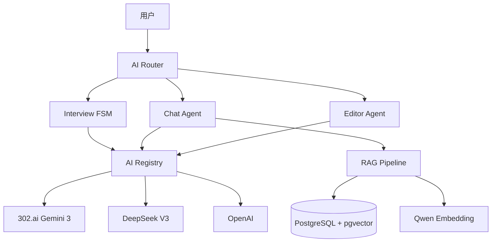
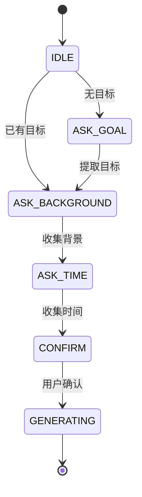

# NexusNote AI 系统文档

**版本**: v3.0
**更新**: 2026-02-03
**状态**: 生产环境运行

---

## 📋 目录

1. [概览](#1-概览)
2. [架构](#2-架构)
3. [核心模式](#3-核心模式)
4. [实现指南](#4-实现指南)
5. [参考](#5-参考)

---

## 1. 概览

### 1.1 什么是 NexusNote AI？

NexusNote AI 是一个**代码驱动**（Code-Driven）的 AI 系统，集成了：
- 🎯 **智能访谈**: 状态机驱动的课程需求采集
- 💬 **知识对话**: RAG 增强的聊天助手
- ✍️ **编辑辅助**: 流式内容生成和文档修改
- 🧠 **学习工具**: 闪卡、测验、思维导图、摘要

### 1.2 核心能力

| 能力 | 描述 | 技术 |
|------|------|------|
| **流式响应** | 实时打字机效果 | streamText + smoothStream |
| **工具调用** | AI 主动使用工具 | Tool-First Generative UI |
| **结构化输出** | 生成 JSON 数据 | streamObject + Zod |
| **上下文记忆** | RAG 知识检索 | pgvector + Qwen Embedding |
| **多模型支持** | 自动降级策略 | 302.ai → DeepSeek → OpenAI |

### 1.3 核心原则

1. **Code-Driven, Not Prompt-Driven** - 代码控制流程，AI 生成内容
2. **Less is More** - 精简提示词，明确指令
3. **Fail-Safe** - 多模型降级，保证可用性
4. **User-First** - 人机交互优先于全自动

---

## 2. 架构

### 2.1 系统架构图



### 2.2 多模型策略

#### 提供商优先级
```
302.ai (Gemini 3 Flash/Pro) → DeepSeek V3 → OpenAI
```

#### 模型配置
| 用途 | 模型 | 特点 | 成本 |
|------|------|------|------|
| **chatModel** | gemini-3-flash-preview | 快速响应 | 0.1x |
| **courseModel** | gemini-3-pro-preview | 课程生成 | 1x |
| **fastModel** | gemini-3-flash-preview | 逻辑提取 | 0.1x |
| **embeddingModel** | Qwen/Qwen3-Embedding-8B | 向量化 | 免费 |

**文件**: `/apps/web/lib/ai/registry.ts`

#### 自动降级逻辑
```typescript
// 按优先级尝试
providers.sort((a, b) => a.priority - b.priority)
for (const provider of providers) {
  if (provider.apiKey && provider.isHealthy) {
    return createModel(provider)
  }
}
```

### 2.3 温度策略 (Temperature Strategy)

温度是**战略资源**，根据任务调整：

| Agent | 温度 | 角色 | 理由 |
|-------|------|------|------|
| **Router** | **0.0** | 大脑 | 分类必须确定 |
| **Interview** | **0.2** | 架构师 | 结构优先 |
| **Editor** | **0.1-0.8** | 工匠 | 动态调整 |
| **Chat** | **0.7** | 伙伴 | 自然对话 |

**文件**:
- `lib/ai/router/route.ts`: `temperature: 0`
- `lib/ai/agents/interview/machine.ts`: `temperature: 0.2`
- `app/api/chat/route.ts`: `temperature: 0.7`

---

## 3. 核心模式

### 3.1 Interview FSM (访谈状态机)

#### 状态流转



#### 智能跳转 (Smart Jump)
```typescript
// 用户输入: "我的目标是：学习Python"
if (extraction.hasGoal && extraction.goal) {
  contextUpdates.goal = extraction.goal
  nextState = 'ASK_BACKGROUND'  // 跳过 ASK_GOAL
}
```

#### 工具调用
```typescript
tools: {
  presentOptions: tool({
    description: "向用户展示一组选项供其选择",
    parameters: z.object({
      options: z.array(z.string()),
    }),
    execute: async ({ options }) => ({ options }),
  }),
}
```

**文件**: `/apps/web/lib/ai/agents/interview/machine.ts`

---

### 3.2 Tool-First Generative UI

#### 工作流程

```
1. 用户输入 → streamText() + tools
2. AI 决定调用工具 → toolInvocation
3. 前端收到 message.parts → 渲染对应 UI 组件
4. 用户交互 (确认/取消) → 回传结果
```

#### 示例：文档编辑

```typescript
// 服务端
const result = streamText({
  model: chatModel,
  tools: {
    editDocument: tool({
      description: "修改文档内容",
      parameters: z.object({
        targetId: z.string(),
        action: z.enum(['replace', 'insert_after', 'delete']),
        newContent: z.string(),
      }),
    }),
  },
})

// 客户端
const { messages } = useChat({ transport })
for (const part of message.parts) {
  if (part.type === 'tool-invocation' && part.toolName === 'editDocument') {
    return <EditConfirmCard args={part.args} />
  }
}
```

**文件**:
- `/apps/web/app/api/chat/route.ts` (服务端)
- `/apps/web/components/chat/ChatSidebar.tsx` (客户端)

---

### 3.3 Hybrid Streaming (混合流)

#### 什么是混合流？

同时输出**文本流** + **结构化数据**：

```typescript
const result = streamText({
  model: model,
  system: systemPrompt,
  prompt: prompt,
  tools: { presentOptions },
})
```

**输出示例**:
```
文本: "我为你准备了以下选项："
Tool: { type: 'tool-presentOptions', args: { options: ['选项1', '选项2'] } }
```

#### 中文优化

```typescript
experimental_transform: smoothStream({
  chunking: new Intl.Segmenter('zh-Hans', { granularity: 'word' }),
})
```

使用 `Intl.Segmenter` 按**中文词语边界**分割，避免字符截断。

---

### 3.4 Human-in-the-Loop (人机交互)

#### 问题：假装交互

**修复前** ❌:
```
Agent: "首先需要澄清用户需求"
Agent: [自己假设需求]
Agent: "已确认用户需求..."  // 根本没等用户输入！
```

**修复后** ✅:
```
Agent: "请问你要准备什么科目的笔试？"
[状态变为 'paused', 等待用户输入]
User: "计算机网络，下个月考试"
Agent: [恢复执行，使用用户输入]
```

#### 实现机制

```typescript
// 步骤类型
type StepType = 'observe' | 'plan' | 'execute' | 'ask_user'
type StepStatus = 'pending' | 'running' | 'completed' | 'waiting_user'

// 执行逻辑
if (step.type === 'ask_user') {
  step.status = 'waiting_user'
  this.state.status = 'paused'
  this.emit({ type: 'paused', reason: step.question })
  await this.waitForResume()  // 等待用户输入
  step.userResponse = userInput
  step.status = 'completed'
}

// 恢复执行
resume(userInput: string): void {
  const waitingStep = this.state.plan?.steps.find(
    s => s.status === 'waiting_user'
  )
  if (waitingStep && userInput) {
    waitingStep.userResponse = userInput
  }
  this.state.status = 'executing'
}
```

---

## 4. 实现指南

### 4.1 Message Handling (消息处理)

#### UIMessage vs CoreMessage

**Vercel AI SDK v6 严格分离**:

| 类型 | 用途 | 结构 |
|------|------|------|
| `UIMessage` | 前端 | 包含 `parts` (Text, ToolInvocation) |
| `CoreMessage` | 后端 | 纯模型输入 |

#### 转换

```typescript
import { convertToCoreMessages } from 'ai'

// 前端 → 后端
const coreMessages = convertToCoreMessages(messages)
```

#### 解析 Tool Parts

```typescript
function getToolParts(message: UIMessage): ToolPart[] {
  const msg = message as any
  if (msg.toolInvocations) {
    return msg.toolInvocations.map((inv: any) => ({
      type: `tool-${inv.toolName}`,
      toolCallId: inv.toolCallId,
      input: inv.args,
    }))
  }
  return []
}
```

---

### 4.2 Tool Definitions (工具定义)

#### 学习工具

```typescript
// apps/web/lib/ai/skills/learning.ts
export const learningSkills = {
  generateQuiz: tool({
    description: "用于将被动阅读转化为主动回忆。请主动使用此工具来验证用户的理解。",
    parameters: z.object({
      topic: z.string(),
      difficulty: z.enum(['easy', 'medium', 'hard']),
    }),
    execute: async ({ topic, difficulty }) => {
      // 生成测验
    },
  }),

  mindMap: tool({
    description: "用于将非结构化文本转化为结构化图谱。请主动使用此工具来辅助解释。",
    parameters: z.object({
      content: z.string(),
    }),
    execute: async ({ content }) => {
      // 生成思维导图
    },
  }),
}
```

#### 编辑工具

```typescript
// apps/web/lib/ai/skills/editor.ts
export const editorSkills = {
  editDocument: tool({
    description: "用于对现有文档进行微创手术（修改、删除、插入）",
    parameters: z.object({
      targetId: z.string(),
      action: z.enum(['replace', 'insert_after', 'delete']),
      newContent: z.string(),
    }),
    execute: async (args) => {
      // 执行编辑
    },
  }),

  draftContent: tool({
    description: "用于生成长文本草稿。前端将渲染为预览卡片。",
    parameters: z.object({
      prompt: z.string(),
      style: z.string().optional(),
    }),
    execute: async (args) => {
      // 生成草稿
    },
  }),
}
```

---

### 4.3 Prompt Strategies (提示词策略)

#### 基础原则

1. **明确指令**: 告诉 AI 做什么，而不是"你可以"
2. **结构化**: 使用标题、列表、示例
3. **简洁**: 避免冗余描述

#### Chat Agent System Prompt

```markdown
你是 NexusNote 的智能助手。

## 你的思考过程 (Chain of Thought)
在回复每一条消息前，请在内心（不输出）思考：
1. **用户意图识别**: 学习/创作/寻找信息？
2. **认知负荷评估**: 需要可视化辅助？需要测试理解？
3. **工具决策**: 哪个工具能"惊喜"到用户？

## 回答规则
1. **Be Proactive**: 不要等指令。如果觉得有帮助，直接调用工具。
2. **Be Concise**: 保持简练。
3. **Be Helpful**: 提供下一步行动建议。
```

**文件**: `/apps/web/lib/ai/agents/chat-agent.ts`

#### Interview Agent Prompt (中文)

```markdown
你是一位专业的课程顾问。你的目标是热情地开始访谈，帮助用户明确学习目标、背景和时间安排。请始终用中文回复。

重要提示：如果需要向用户展示选项，请调用 'presentOptions' 工具。不要在文本响应中输出 JSON。
```

**文件**: `/apps/web/lib/ai/agents/interview/machine.ts`

---

### 4.4 Stream Optimization (流优化)

#### smoothStream 配置

```typescript
experimental_transform: smoothStream({
  chunking: new Intl.Segmenter('zh-Hans', { granularity: 'word' }),
  delayInMs: 10,  // 可选，默认 10ms
})
```

#### stopWhen 替代 maxSteps

```typescript
import { stepCountIs } from 'ai'

streamText({
  stopWhen: stepCountIs(3),  // 最多 3 步工具调用
})
```

#### 自定义 Transport

```typescript
// apps/web/lib/ai/transport.ts
export const transport = new DefaultChatTransport({
  api: '/api/chat',
  headers: {
    'Content-Type': 'application/json',
  },
})
```

---

## 5. 参考

### 5.1 核心文件

| 文件 | 说明 |
|------|------|
| `apps/web/lib/ai/registry.ts` | AI 模型注册中心 |
| `apps/web/lib/ai/agents/chat-agent.ts` | Chat Agent 定义 |
| `apps/web/lib/ai/agents/interview/machine.ts` | Interview FSM |
| `apps/web/lib/ai/skills/` | 所有工具定义 |
| `apps/web/app/api/chat/route.ts` | Chat API |
| `apps/web/app/api/learn/interview/route.ts` | Interview API |

### 5.2 API 端点

| 端点 | 方法 | 功能 |
|------|------|------|
| `/api/chat` | POST | 通用聊天 |
| `/api/learn/interview` | POST | 课程访谈 |
| `/api/learn/generate` | POST | 生成课程大纲 |
| `/api/learn/generate-content` | POST | 生成章节内容 |
| `/api/flashcard/generate` | POST | 生成闪卡答案 |

### 5.3 外部资源

- [Vercel AI SDK v6 文档](https://ai-sdk.dev/docs)
- [Generative UI 指南](https://ai-sdk.dev/docs/ai-sdk-ui/generative-user-interfaces)
- [smoothStream API](https://ai-sdk.dev/docs/reference/ai-sdk-core/smooth-stream)
- [Qwen Embedding 文档](https://modelscope.cn/models/Qwen/Qwen3-Embedding-8B)

---

## 附录：关键概念速查

### 状态机 (FSM)
代码控制的状态流转，而非 AI 自己决定。

### 工具优先 (Tool-First)
AI 通过工具调用来触发 UI 组件，而非直接生成 HTML。

### 混合流 (Hybrid Stream)
同时输出文本流和结构化数据（工具调用）。

### 人机循环 (Human-in-the-Loop)
Agent 在必要时暂停等待用户输入，而非自己假设。

### 温度策略 (Temperature Strategy)
根据任务类型动态调整 AI 的"创造性"。

### 多模型降级 (Multi-Model Fallback)
主模型失败时自动切换备用模型，保证可用性。

---

**文档维护者**: NexusNote AI Team
**最后更新**: 2026-02-03
**版本**: v3.0 (合并5个文档)
