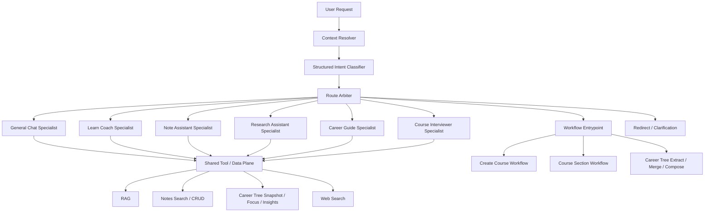

# ADR: 统一 NexusNote AI Runtime 为 Router + Specialists + Workflow Core

状态：Proposed  
日期：2026-05-14

## 背景

NexusNote 当前 AI runtime 已经具备几条正确主线：

- 运行时统一走单 provider + model policy + route profile，[docs/AI.md](/Users/findbiao/projects/nexusnote/docs/AI.md#L5)
- 开放式对话使用 `ToolLoopAgent`，固定副作用使用 workflow，[docs/AI.md](/Users/findbiao/projects/nexusnote/docs/AI.md#L63) 与 [docs/AI_SDK_V6_PROJECT_GUIDELINES.md](/Users/findbiao/projects/nexusnote/docs/AI_SDK_V6_PROJECT_GUIDELINES.md#L17)
- RAG 已经是 `rewrite -> vector -> keyword -> RRF` 的共享能力层，[docs/AI.md](/Users/findbiao/projects/nexusnote/docs/AI.md#L83)
- career trees 已经是 user-scoped snapshot + deterministic compose 的真相层

但当前对话运行时仍有明显结构缺口：

- chat 热路径只有 `CHAT_BASIC` 和 `LEARN_ASSIST` 两类上下文分流，[lib/ai/context/resolve-chat-context.ts](/Users/findbiao/projects/nexusnote/lib/ai/context/resolve-chat-context.ts#L6)
- capability profile 仍是窄的旧抽象，[lib/ai/core/capability-profiles.ts](/Users/findbiao/projects/nexusnote/lib/ai/core/capability-profiles.ts#L4)
- `/api/chat` 仍然是“拿到 profile 就起 agent”，缺少正式的 intent routing 与 route arbitration，[app/api/chat/route.ts](/Users/findbiao/projects/nexusnote/app/api/chat/route.ts#L77)

这导致系统虽然已经有 learn / notes / career / interview 等能力边界，但运行时还没有把“任务契约”“执行模式”“数据范围”收成统一结构。

## 问题

如果继续沿用当前抽象，会出现这几类问题：

1. profile 名称承担过多职责
- 同时混了 surface、能力、工具边界和 prompt 选择

2. 新能力扩展只能继续堆分支
- 加 `research`、`career guide`、`note distill` 时，容易退化成 `if/else` 热路径

3. router 无法被评测
- 现在几乎没有“这次为什么选这个能力模式”的结构化产物

4. workflow 与 specialist 边界容易变模糊
- 真副作用、强状态链路有被重新塞回对话热路径的风险

## 决策

采用统一 AI runtime 架构：



### 1. 用四层抽象替代单一 `profileId`

运行时主抽象统一为：

- `surface`
- `capabilityMode`
- `executionMode`
- `dataScope`

建议核心类型：

```ts
type Surface = "chat" | "learn" | "notes" | "career" | "interview";

type CapabilityMode =
  | "general_chat"
  | "learn_coach"
  | "note_assistant"
  | "research_assistant"
  | "career_guide"
  | "course_interviewer";

type ExecutionMode =
  | "direct_answer"
  | "tool_loop"
  | "workflow"
  | "redirect"
  | "ask_clarification";

type DataScope = "session" | "course" | "notes" | "career_tree" | "web";
```

### 2. 在所有对话请求前增加 router 三段式

#### Context Resolver

只负责把事实解出来，不负责选 specialist：

- 当前 surface
- metadata / course / editor / session 资源
- learning guidance 是否存在
- career tree snapshot 是否存在
- route profile / skin / 用户策略

#### Structured Intent Classifier

使用结构化输出的小模型分类器，而不是正则或纯关键词匹配。

分类结果必须是 schema 校验过的 JSON，至少包含：

- `intent`
- `capabilityMode`
- `executionMode`
- `requiredScopes`
- `confidence`
- `reasons`

#### Route Arbiter

代码层仲裁，不允许模型直接决定一切。

硬约束示例：

- 没有课程上下文，不允许落到 `learn_coach`
- 没有 career tree snapshot，`career_guide` 只能降级或先澄清
- 真实写入或长任务不能留在普通 specialist 中，必须进入 workflow 或 redirect
- interview surface 默认优先 `course_interviewer`

### 3. specialist 长期固定为少量 task-based roles

长期只保留这 6 个 specialist：

- `general_chat`
- `learn_coach`
- `note_assistant`
- `research_assistant`
- `career_guide`
- `course_interviewer`

不按学科拆 `python-agent`、`pm-agent`、`marketing-agent` 一类 specialist。

领域差异主要通过：

- retrieval policy
- 当前课程/笔记上下文
- career tree snapshot
- prompt context

来表达，而不是通过无限增加 specialist 数量。

### 4. `AIRouteProfile` 继续只负责模型链路偏好

[route-profiles.ts](/Users/findbiao/projects/nexusnote/lib/ai/core/route-profiles.ts) 保留，但语义必须保持纯净：

- 它只影响模型链路组合
- 它不负责任务语义路由
- 它不替代 intent classifier

### 5. RAG 是共享 data plane，不是独立 agent

共享 data plane 包括：

- RAG
- notes search / CRUD
- career tree snapshot / focus / insights
- web search

specialist 只是在同一 data plane 上采用不同 retrieval / tool policy。

### 6. workflow 与 deterministic core 保持独立

以下链路继续保持 workflow / truth core 身份，不纳入开放式 specialist 决策：

- create course
- generate course section
- career tree extract
- career tree merge
- career tree compose
- snapshot projection
- progress aggregation
- conversation persistence

其中 career tree compose 继续保持 deterministic truth core，specialist 只读取快照，不拥有真相。

### 7. 直接切换，不保留兼容层

本 ADR 明确选择 direct cutover：

- 不保留新的 runtime contract 到旧 `AgentProfile` 的长期映射层
- 不保留 `resolveRequestContext()` 与 `resolveChatContext()` 双实现并存
- 不保留 `ChatMetadata` 与 `RequestMetadata` 的长期双命名
- 不把旧 `CHAT_BASIC / LEARN_ASSIST / NOTE_ASSIST` 继续当成终局概念

允许的回退方式只有代码回滚，不是运行时双轨兼容。

## 不做什么

本决策明确不做：

- 不把所有任务都做成 agent
- 不按学科拆大量 specialist
- 不让 router 用正则硬匹配意图
- 不让 specialist 直接掌管 career tree truth / snapshot truth
- 不让 `AIRouteProfile` 承担任务语义路由

## 影响

### 正面影响

- 运行时抽象更清楚，新增 specialist 不再继续污染热路径
- route decision 变成可观测、可评测的正式产物
- workflow 与 specialist 边界清楚，避免强状态任务退回 prompt 驱动
- RAG、notes、career tree 的复用边界更干净

### 成本

- 需要对 chat 主链路做一次结构性重构
- capability profile、metadata、prompt registry 会被一次性重组
- eval 体系需要新增 routing domain

## 验收标准

当以下条件成立时，视为本 ADR 真正落地：

- `/api/chat` 不再直接依赖 `resolveChatContext() -> profileId -> createChatAgent()` 这条旧主链
- 每次对话请求都能产出结构化 `RouteDecision`
- telemetry 能记录 `surface / capabilityMode / executionMode / routeConfidence`
- 至少存在 `general_chat / learn_coach / note_assistant / research_assistant / career_guide / course_interviewer` 6 个正式 specialist
- career-tree / create-course / section generation 仍然留在 workflow plane
- `bun run ai:eval routing` 与现有 `chat / learn / notes` eval 共存

## 迁移提示

具体分阶段替换路径见 [2026-05-14-ai-runtime-migration-plan.md](/Users/findbiao/projects/nexusnote/docs/plans/2026-05-14-ai-runtime-migration-plan.md)。
