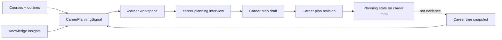

# Career Map Interview Implementation Plan

> **For Claude:** REQUIRED SUB-SKILL: Use superpowers:executing-plans to implement this plan task-by-task.

**Goal:** Build a course-driven career planning workspace where NexusNote leads a consultative interview from existing course evidence, then keeps a live Career Map aligned with the user's selected route.

**Architecture:** The career product is a new vertical layer on top of the existing course, knowledge, and career-tree systems. Course and skill evidence remain the source of truth for demonstrated ability; career-planning conversations produce preference, constraint, route, and plan revisions only.

**Tech Stack:** Next.js 16 App Router, React 19, AI SDK v6, Auth.js v5 database sessions, Drizzle ORM, PostgreSQL, Tailwind utility classes, Biome, Bun.

---

## Product Contract

Career planning is not a form, quiz, resume tool, or generic chat. It is a guided interview that starts from the user's existing courses and learning evidence.

The default mental model is:

```text
course evidence -> initial career hypothesis -> one consultative question -> user calibration -> career map revision
```

界面布局必须和课程访谈的心智模型一致，不另起一套相反结构：

```text
桌面端：左侧是职业地图，也就是证据和结果面板；右侧是职业访谈，也就是咨询式对话。
移动端：先进入职业访谈；底部用一张克制的职业地图卡片承接状态，点击后进入地图视图。
```

这里的“左侧”不是导航侧栏，也不是信息堆料区，而是用户随时能对照的职业判断结果：

- 当前规划主线。
- 课程和技能树给出的证据。
- 仍需校准的缺口。
- 候选路线之间的取舍。

这里的“右侧”不是自由聊天，而是咨询师式访谈：

- 先基于课程证据提出观察。
- 再给出当前假设。
- 每轮只问一个会改变路线判断的问题。
- 当判断变化时，用结构化职业地图草稿更新左侧面板。

## Non-Negotiable Decisions

- Do not ask users to provide a large profile upfront.
- Do not turn subjective answers into mastered skills.
- Do not replace the current career-tree evidence layer with planning data.
- Do not expose provider/debug/research plumbing in this user flow.
- Do not make resume optimization the first-class feature yet.
- Keep `/career-trees` as a lower-level skill tree explorer; make `/career` the product entry.
- In development, login must be direct and local-only; production keeps magic link / email code.

## Data Boundaries

Evidence layer:

- Existing tables: `courses`, `course_outline_versions`, `course_outline_nodes`, `career_*`, `knowledge_*`.
- Meaning: what the user has learned, practiced, saved, or produced.
- May affect `mastered`, `in_progress`, evidence score, course support.

Planning layer:

- New planned tables should represent interview sessions, route drafts, user constraints, selected route, and revisions.
- Meaning: what the user wants, hesitates about, prefers, or plans to do next.
- May affect route ranking, recommended next courses, and plan-state skill gaps.
- Must not directly mark a skill as mastered.

## Current Implementation State

Already implemented in this branch:

- `/career` route.
- `CareerPlanningClient` with left Career Map evidence/result panel and right consultative interview.
- `CareerMapPanel` for current route, course signals, gaps, and candidate routes.
- `lib/career-planning/workspace-data.ts` to derive a course-driven planning context from existing career-tree workspace data.
- Chat metadata `entry: "planning"` so the existing `career_guide` specialist receives career-planning context.
- Profile, insights, and chat navigation now point to `/career`.
- Local-only development login through `/api/auth/dev-login`.
- Append-only career planning sessions and revisions.
- Structured career-map draft delivery through `presentCareerMapDraft`, forwarded as client state rather than rendered as a tool card.
- Latest planning revision restore on `/career`, including the same planning session id and last map draft.
- "确认主线" writes planning-state revision only; it does not mark skill nodes mastered.

## Target Architecture



## Task 1: Stabilize Design And Implementation Docs

**Files:**

- Create: `docs/plans/2026-05-27-career-map-interview.md`
- Modify: `docs/README.md`

**Steps:**

1. Save the product contract, architecture, non-negotiable decisions, and implementation tasks in this document.
2. Add a docs index link so future work starts from this plan.
3. Run `bun run lint`.
4. Run `bun run typecheck`.

**Acceptance Criteria:**

- The plan explicitly separates evidence state from planning state.
- The plan states left Career Map evidence/result panel and right consultative interview as the canonical layout.
- The plan states dev login must be local-only and production must stay magic-link based.

## Task 2: Add Local-Only Dev Login

**Files:**

- Create: `app/api/auth/dev-login/route.ts`
- Modify: `app/login/page.tsx`

**Steps:**

1. Create a `GET /api/auth/dev-login` route.
2. Reject requests when `process.env.NODE_ENV === "production"`.
3. Upsert a development user by email.
4. Create a database session in the existing `sessions` table.
5. Set the `authjs.session-token` cookie with `httpOnly`, `sameSite: "lax"`, and local path `/`.
6. Redirect to a safe relative `callbackUrl`.
7. Add a development-only login button on `/login`.
8. Run browser verification against `/career`.

**Acceptance Criteria:**

- Development login does not use Resend.
- Production builds still hide the dev login button.
- The resulting session is readable through existing `auth()`.

## Task 3: Persist Career Planning Revisions

**Files:**

- Create: `db/schema/career-planning.ts`
- Modify: `db/schema.ts`
- Create: `lib/career-planning/revisions.ts`
- Create: `app/api/career-planning/revisions/route.ts`

**Steps:**

1. Add `career_planning_sessions`.
2. Add `career_plan_revisions`.
3. Store `sourceSnapshotJson`, `signalsJson`, `routesJson`, `constraintsJson`, and `selectedRouteKey`.
4. Use append-only revisions; do not mutate past conclusions.
5. Add a save endpoint for the current draft.

**Acceptance Criteria:**

- A career plan can be saved and later restored.
- Revisions are scoped by `userId`.
- No planning revision changes evidence skill state.
- A save before the first chat message must not create an invalid conversation foreign key.

## Task 4: Add Career Map Draft UI Parts

**Files:**

- Create: `lib/ai/career-planning/schemas.ts`
- Create: `lib/ai/tools/career/planning.ts`
- Modify: `lib/ai/tools/index.ts`
- Modify: `components/career-planning/CareerMapPanel.tsx`

**Steps:**

1. Define a strict Zod schema for a career-map draft.
2. Add `presentCareerMapDraft` as a structured client-state tool part, not a visible tool card.
3. Render route changes, user constraints, key uncertainties, and next question in the panel.
4. Keep provider/tool metadata hidden.

**Acceptance Criteria:**

- The chat can update the map without relying on parsing assistant prose.
- The map remains usable even while the assistant streams.
- Generic chat rendering must suppress state-only tool parts so tool plumbing never leaks into the user-facing transcript.

## Task 5: Commit Planning State Back To Career Map

**Files:**

- Modify: `lib/career-planning/workspace-data.ts`
- Modify: `components/career-planning/CareerMapPanel.tsx`
- Create or modify: `app/api/career-planning/current-route/route.ts`

**Steps:**

1. Add a restrained "设为当前主路线" action.
2. Save selected route to planning state.
3. Keep existing `/api/user/career-trees` preference update available for the lower-level career tree.
4. Show selected route as planning state, not evidence mastery.

**Acceptance Criteria:**

- Users can commit a route without corrupting learned-skill evidence.
- The route can be changed later through a new revision.
- Reloading `/career` should restore the latest planning route and map draft.

## Task 6: Final Verification

**Commands:**

```bash
bun run lint
bun run typecheck
SKIP_ENV_VALIDATION=true bun run build
git diff --check
```

**Browser Checks:**

- `/login` in development shows direct login.
- `/career` redirects unauthenticated users to `/login?callbackUrl=%2Fcareer`.
- Dev direct login returns to `/career`.
- Desktop `/career` shows Career Map evidence/result panel on the left and consultative interview on the right.
- Mobile `/career` starts in conversation view and opens map via bottom card.
