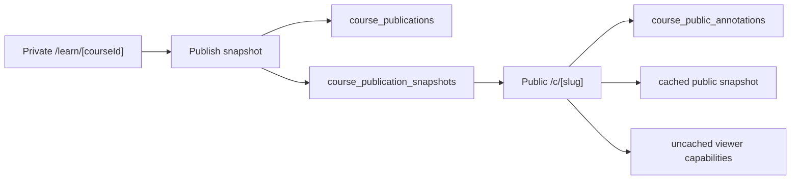

# Course Sharing And Public Annotations

Date: 2026-05-30
Status: implemented

## Goal

Course sharing should feel like the same NexusNote course reader, not a separate public marketing
page. A learner who opens a shared link should read the course in the same calm learning surface,
with a reduced capability set until they save the course to their own library.

The product rule is:

> One course reader, two data contexts: private course instance and public publication snapshot.

## Current State

The private learning route stays owner-scoped:

- `/learn/[id]` requires an authenticated session before rendering.
- `getLearnPageSnapshotCached(userId, courseId)` reads only owned courses.
- The private projection mixes course content with personal progress and private section
  annotations.

That model stays intact. Publishing must not make the private course row public, because it
would blur content, progress, private notes, chat history, and future career-tree learning signals.

## Product Shape

### Author

From the private learning page, the author can publish a course link. The first release supports a
simple unlisted publication:

- `Publish` creates or refreshes a public snapshot from the current course content.
- `Copy link` copies `/c/[slug]`.
- `Revoke` disables the public link.

The author still reads and learns from the private `/learn/[courseId]` route. Publication management
is a lightweight capability on the same reader, not a separate destination.

Implemented files:

- `components/course-reader/CoursePublishControl.tsx`
- `app/api/courses/[id]/publication/route.ts`
- `lib/learning/course-sharing.ts`

### Visitor

Opening `/c/[slug]` renders the same course-reading layout with public capabilities:

- Read the course outline and sections.
- View public annotations.
- Add a public annotation after signing in.
- Save the course into their own learning library later.

Visitor state is not the author's state. The public page never exposes private progress, private
annotations, private notes, private chat messages, or career-tree signals.

Implemented files:

- `app/c/[slug]/page.tsx`
- `components/course-reader/PublicCourseReader.tsx`
- `app/api/public/courses/[slug]/save/route.ts`

### Public Annotations

Public annotations are a discussion layer on top of an immutable publication snapshot. They are not
collaborative editing.

Rules:

- A public annotation belongs to a publication and one published section key.
- It stores a quote anchor so it can be rendered near selected text.
- It is append-only for MVP; moderation can hide annotations without deleting history.
- Only authenticated users may write. Guests can read visible annotations.
- The write API rejects annotations whose `sectionKey` is not part of the current published
  snapshot.

## Architecture



## Data Model

### course_publications

Canonical public entry for a course.

- `id`
- `sourceCourseId`
- `ownerUserId`
- `slug`
- `title`
- `description`
- `status`: `published | revoked`
- `allowAnnotations`
- `currentSnapshotId`
- `publishedAt`
- `revokedAt`
- `createdAt`
- `updatedAt`

### course_publication_snapshots

Immutable content snapshot for rendering a public course.

- `id`
- `publicationId`
- `sourceCourseId`
- `sourceOutlineVersionId`
- `snapshotHash`
- `contentJson`
- `createdAt`

`contentJson` stores public-safe course data:

- course metadata
- chapters and sections
- section markdown content
- research citations

It does not store personal progress, private annotations, notes, or chat.

### course_public_annotations

Public discussion notes anchored to a publication snapshot.

- `id`
- `publicationId`
- `snapshotId`
- `sectionKey`
- `userId`
- `anchor`
- `quotedText`
- `body`
- `status`: `visible | hidden`
- `createdAt`
- `updatedAt`

## Reader Projection

The public reader uses a public-safe projection in `lib/learning/course-sharing-types.ts`:

```ts
interface PublicCourseReaderProjection {
  publication: PublicCoursePublicationProjection;
  snapshotId: string;
  content: CoursePublicationSnapshotContent;
  annotations: PublicCourseAnnotationProjection[];
  viewer: {
    userId: string | null;
    role: "owner" | "reader" | "guest";
  };
  capabilities: {
    canAnnotatePublicly: boolean;
    canModeratePublicAnnotations: boolean;
    canSaveToLibrary: boolean;
  };
}
```

Important implementation detail: the cached loader only returns public snapshot data. Viewer role
and capabilities are computed outside the `"use cache"` function so one visitor's role cannot leak
to another visitor through the public page cache.

## Routes

### Private APIs

- `POST /api/courses/[id]/publication`
  - Auth required.
  - Requires course ownership.
  - Creates or refreshes the public snapshot.
  - Returns `{ publicationId, slug, url, status }`.

- `GET /api/courses/[id]/publication`
  - Auth required.
  - Requires course ownership.
  - Returns current publication state so the publish control survives page refresh.

- `DELETE /api/courses/[id]/publication`
  - Auth required.
  - Requires course ownership.
  - Revokes the link.

### Public APIs

- `POST /api/public/courses/[slug]/annotations`
  - Auth required.
  - Requires publication to be published and annotations enabled.
  - Creates one visible public annotation.
  - Returns the created annotation projection so the client can update without a full reload.

- `POST /api/public/courses/[slug]/save`
  - Auth required.
  - Copies the public snapshot into the viewer's own `courses`, outline, sections, and progress
    records.
  - Returns `/learn/[newCourseId]`.

### Pages

- `/c/[slug]`
  - Public course reader.
  - Optional auth is allowed, but anonymous readers can still read.

## Caching

Publication snapshots are cache-friendly, but public annotations need read-after-write behavior.
The public loader uses tags:

- `course-publication:${slug}`
- `course-publication:${publicationId}`

Publishing, revoking, and creating public annotations revalidate those tags. Unlike background
profile/recent-course caches, public course tags use immediate expiration with `expire: 0`, because
readers should see a newly posted public annotation on the next page load.

The private learn cache stays user/course scoped.

## Security And Privacy

- Do not expose raw `courseId` as the public URL.
- Do not query private course data from `/c/[slug]`.
- Do not include private annotations, progress, notes, chat messages, user profile data, or
  career-tree data in snapshots.
- Public annotation body length is capped.
- Public annotation `sectionKey` must exist in the current publication snapshot.
- Hidden annotations remain unavailable to public readers.
- Owner moderation is separate from reader creation.
- Client components import public reader types from `lib/learning/course-sharing-types.ts` instead
  of importing the server-only service module.

## Acceptance Criteria

- An owner can publish a private course from `/learn/[id]`.
- Publishing returns a stable `/c/[slug]` link.
- The publish control can read the existing published link after page refresh.
- `/c/[slug]` renders without login.
- Public page shows course metadata, chapters, section content, citations, and visible public
  annotations.
- Logged-in users can add a public annotation on the public page.
- Public annotation creation updates the page without a full reload.
- Guests are prompted to sign in before writing annotations.
- Logged-in readers can save the public course into their own learning library.
- Owner can revoke the public link.
- Private progress and private annotations are not visible on the public page.

## Validation

Completed locally:

- `bunx biome check` on the course-sharing touched files.
- `bun run typecheck`.
- `SKIP_ENV_VALIDATION=true bun run build`.
- `bun run db:push`.
- `bun scripts/start-workers.ts` reached `QueueWorkersRuntime Ready`.
- Runtime API checks:
  - owner publish returned `/c/lBPUh55M`;
  - anonymous `GET /c/lBPUh55M` returned `200`;
  - invalid public annotation section key returned `400`;
  - valid public annotation returned `200` and appeared on the next public page load;
  - a second logged-in user saved the public course and received `/learn/283c2e92-c4ec-48fc-9314-0ba524ae40d0`.
